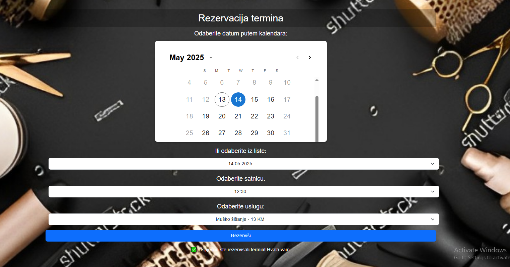

# Hairdressing Salon Reservation App

## Overview

This project is a web-based frontend application built using React. The app allows users to find and book appointments at hairdressing salons. Users can search for salons based on their location using an interactive map, view available stylists and their ratings, select desired services, check prices, and easily reserve a time slot at the chosen salon.

### 🏠 Home Page


### About Us


### Contact


### Login


### Salon


### Reservation


### Calendar


## Features

- **Salon Search**: Users can search for hair salons based on their location, displayed on an interactive map.

- **Stylist Overview**: Display a list of available stylists within the selected salon, along with their ratings and reviews.

- **Service Selection**: Users can browse through various services offered by the salon, view details, and select the ones they wish to book.

- **Appointment Booking**: Simplified booking process where users can select a time slot, confirm their reservation, and receive a booking confirmation.

- **User-Friendly Interface**: Clean and responsive design with easy navigation for an enhanced user experience.

## Technologies Used

- **React**: JavaScript library for building the user interface.

- **React Router**: For handling navigation and routing within the app.

- **Bootstrap**: For styling and ensuring a responsive, modern design.

- **Axios**: For handling HTTP requests to the backend (to be integrated).

- **Map API**: Integration with a map API for location-based search and salon display (e.g., Google Maps, Mapbox).

## Project Structure 
- **src/**
    - **components/**: Contains reusable UI components (e.g., Button, Card, Header, Footer).
    - **pages/**: Contains main pages of the application (e.g., Home, Login, Registration).
    - **services/**: Handles API calls and data fetching.
    - **App.jsx**: Main component where routing and primary app logic is handled.
    - **index.js**: Entry point for the React application.
    - **styles/**: Contains global and component-specific CSS files.

## Installation and Setup

1. **Clone the repository:**
```
git clone https://github.com/yourusername/hairdressing-salon-app.git
```
2. **Navigate to the project directory:**
```
cd hairdressing-salon-app
```
3. **Install dependencies:**
```
npm install
```
4. **Start the development server:**
```
npm start
```

## Future Enhancements

- **Payment Integration:** Enable users to pay for services online when booking an appointment.

- **Notifications:** Implement notifications to remind users of upcoming appointments.

## Contributing
Contributions are welcome! If you have any suggestions or improvements, please submit a pull request or open an issue.

## Contact
For any inquiries or support, please contact fejzo999@gmail.com